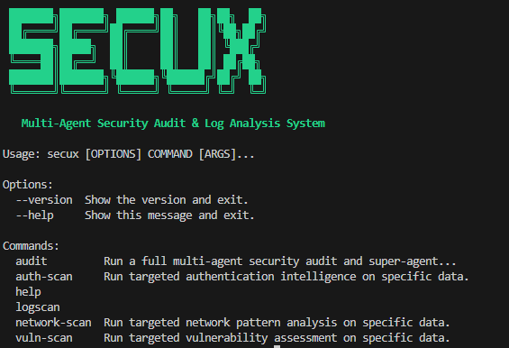
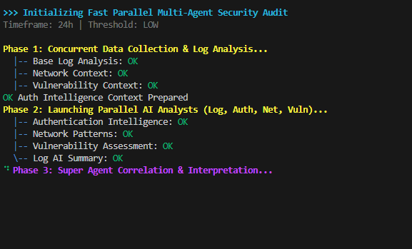
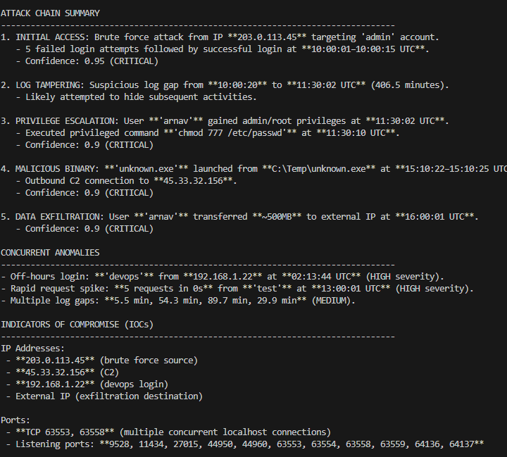
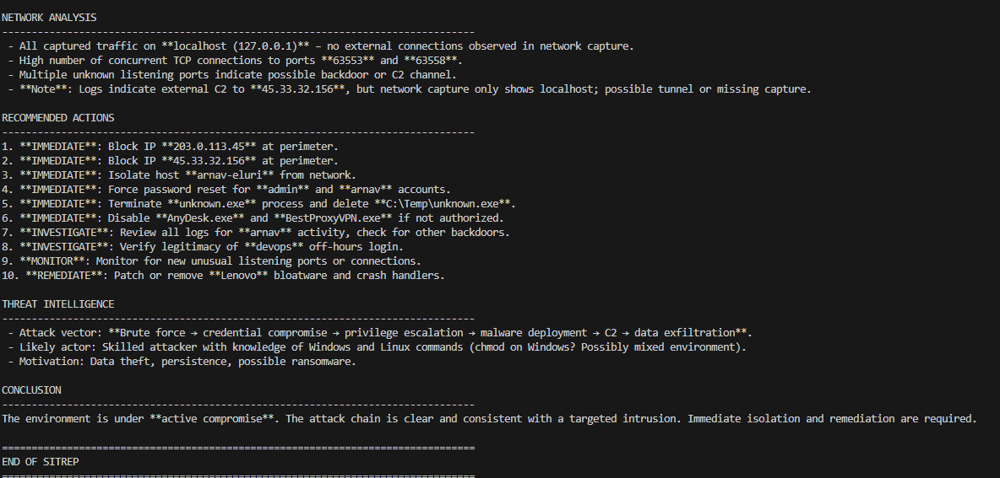

# 🛡️ SecuX: Multi-Agent Security Audit & Log Analysis System

<p align="center">
  
</p>


SecuX is a high-performance, AI-driven cybersecurity orchestration platform. It utilizes a network of specialized AI agents to perform deep security audits, reconstruct complex attack chains, and provide actionable intelligence from raw system telemetry.

---

## 🚀 Key Features

*   **Multi-Agent Orchestration**: Specialized agents for Logs, Authentication, Network, and Vulnerability analysis.
*   **Super-Agent Correlation**: An advanced logic engine that synthesizes individual findings into a cohesive incident narrative.
*   **Attack Chain Reconstruction**: Automatically identifies the progression from Initial Access to Data Exfiltration.
*   **SITREP Generation**: Produces "Situation Reports" with high-confidence threat intelligence and Indicators of Compromise (IOCs).
*   **Real-time Monitoring**: Continuous log scanning with live anomaly detection and reporting.
*   **Vendor Agnostic**: Seamlessly switches between OpenRouter, Google Gemini, and Local LLMs (Ollama).

---

## 🛠️ CLI Usage

<p align="center">
  
  
</p>

SecuX features a rich, colorized terminal interface for maximum clarity during audits.

### Core Commands

| Command | Description |
| :--- | :--- |
| `secux audit` | **Main Engine**: Runs a full parallel multi-agent audit and generates a SITREP. |
| `secux logscan` | Analyzes system logs for anomalies. Use `--monitor` for real-time tracking. |
| `secux auth-scan` | Targets authentication logs to identify brute force or credential stuffing. |
| `secux network-scan` | Processes network captures to find C2 channels and suspicious patterns. |
| `secux vuln-scan` | Evaluates system configuration and data for known vulnerability patterns. |

### Example
```powershell
# Run a full audit with a 24h timeframe
secux audit --timeframe 24h --threshold LOW
```

---

## 📦 Installation & Setup

### Prerequisites
- **Python 3.10+**
- An API Key for **OpenRouter** or **Google Gemini** (unless using local Ollama).

### Step-by-Step Installation

<<<<<<< HEAD
1. **Clone & Navigate**:
   ```bash
   git clone https://github.com/itseluriiiiii/SecuX.git
   cd SecuX/Backend
   ```

2. **Install Dependencies**:
   ```bash
   pip install -r requirements.txt
   ```

3. **Install SecuX Package**:
   ```bash
   pip install -e .
   ```

4. **Environment Configuration**:
   Create a `.env` file in the `Backend` directory:
   ```env
   LLM_PROVIDER=openrouter
   OPENROUTER_API_KEY=your_api_key_here
   OPENROUTER_MODEL=meta-llama/llama-3.3-70b-instruct:free
   ```

---

## 📊 Intelligence Output (SITREP)

<p align="center">
  
</p>

SecuX doesn't just list logs; it provides **contextual intelligence**. A standard SITREP includes:

### 1. Attack Chain Summary
A chronological breakdown of the breach:
- **Phase 1 (Initial Access)**: e.g., Brute force from IP `203.0.113.45` targeting 'admin'.
- **Phase 2 (Privilege Escalation)**: e.g., Execution of `chmod 777 /etc/passwd` by user 'arnav'.
- **Phase 3 (Malicious Binary)**: e.g., `unknown.exe` launched with outbound C2 connections.

### 2. Indicators of Compromise (IOCs)
*   **IP Addresses**: Automated extraction of attacker sources and C2 destinations.
*   **Network Ports**: Identification of backdoor listeners (e.g., non-standard TCP ports).

### 3. Recommended Actions

<p align="center">
  
</p>

Priority-ranked remediation steps:
- 🔴 **IMMEDIATE**: Block malicious IPs and isolate compromised hosts.
- 🟠 **INVESTIGATE**: Review logs for specific lateral movement patterns.
- 🟡 **MONITOR**: Watch for new unusual listening ports or connections.

---

## ⚙️ Technology Stack

- **Intelligence**: Multi-Agent Orchestration (LLM-based)
- **Models**: Llama 3.3, Minimax (via OpenRouter), Gemini 1.5 Flash
- **Framework**: Python Click & Rich
- **Real-time**: Watchdog API for live filesystem monitoring
- **Data**: JSON-based report persistence

---

## 🔖 Version
**Current Version**: `0.1.0`

---

> [!IMPORTANT]
> **LEGAL DISCLAIMER**: This tool is for **authorized security testing and educational purposes only**. Usage against systems without prior consent is illegal and strictly prohibited. The developers assume no liability for misuse.
=======
### Execution Note
If the `secux` command is not recognized (due to PATH issues), always use the `python -m` syntax:
```powershell
python -m secux.cli <command>
```
>>>>>>> ae476baba89b0052332e1fc7b3bc794bf1a222cb
